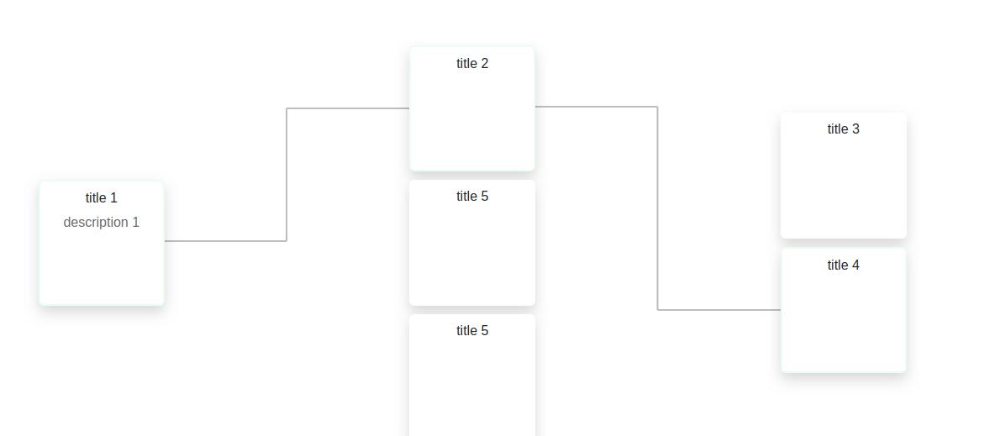

# Scenario Graph

This library provides a simple graph allowing the user to dynamically generate a scenario using preconfigured choices .

You can try it out and explore the options here : [Live demo](https://codesandbox.io/s/scenariograph-lrrlm)



## Installation
### With CDN

##### In your main HTML file :

Import the css and js files in the head tag of your html document 
```html
<link rel="stylesheet" href="https://res.cloudinary.com/amine-lejmi/raw/upload/v1578917478/scenarioGraph/scenarioGraph.styles_rnxukc.css">
<script src="https://res.cloudinary.com/amine-lejmi/raw/upload/v1578917478/scenarioGraph/scenarioGraph.main_tdw5hx.js"></script>
```

### Locally: ES5
Download the **scenarioGraph.main.js** and
**scenarioGraph.styles.css** located in the **dist** directory, and import them in the head tag of your html document

### Locally: ES6
If you want to integrate the ES6 (non mignified) version of the library : 

* download **scenarioGraph.js** located in the src directory
, and import it in your js file:
```js
import Scenario from './src/scenarioGraph.js';
```
* download **scenarioGraph.css** located in the src directory
  , and import it in your html file:
```html
<link rel="stylesheet" href="./src/scenarioGraph.css">
```

## Usage
### Basic usage

##### In your main HTML file
- Create the HTML structure
```html
 <div id="id-of-your-container"> 
   <svg></svg>
 </div>
```

##### In your main JS file
- Import the library in your main javascript file :

```js
const Scenario = ScenarioGraph.default;
```

- Select and put your container in a variable :
```js
mainContainer = document.getElementById("id-of-your-container");
```
- Create the object containing your main data :

```js
data = [
        {
            title: "title",
            description: "description",
            _children: [
                {
                    title: "title 2",
                    description: "description 2"
                },
                {
                  ...
```
- Instantiate your graph with your data

```js
 new Scenario(mainContainer, data);
````
### Options

The instantiation of the scenario accepts a third optional parameter, allowing you to customize your graph:
```js
...
options = {
        ...
    };

new Scenario(mainContainer, data, options);
```

| Attribute | Type | Default | Description |
|-----------|------|---------|-------------|
storeChanges|Boolean|false|Stores the changes in the localStorage|
strokeColor|String|"bcbdbd"|Color of the graph lines, hex color|
strokeWidth|String|"3"|The width of the graph lines|
cardShadowColor|String|"0,0,0,0.15"| The color of the cards shadow, rgba color without braces|
selectedCardBorderColor|String|"228B22"|The border color of the selected cards, hex color
selectedCardBorderWidth |String|"2"|The border width of the selected cards|

### Output
If you put the instance your created into a variable, you can access some output methods:
```js
 let scenario = new Scenario(mainContainer, data, options);
```

####Methods
##### generateScenario(): 
Allows you to export an array containing the selected scenario

##### generateScenarioFields(fields: Array) : 
Allows you to export only the fields you need from the selected scenario
```js
scenario.generateScenarioFields(["title", "_id"]);
```
- If one of the fields doesn't exist in the data object, it will be ignored

- If the fields array contains only one element, the output will 
be a simple array containing the values of the field

- If the fields array contains many elements, the output will be
an array of objects.

## Version
* **V1.0.0** *Initial release*

## Author
* **Mohamed Amine LEJMI** - *Initial work* - [lejmi.amine@gmail.com](lejmi.amine@gmail.com)

## Contributing
To modify the library and improve it :
* Clone the project
* Install npm dependencies (it uses webpack and babel to transpile and minify the files)
* **npm run watch** to watch and build changes in css and js files
* **npm run build** to build the dist files
